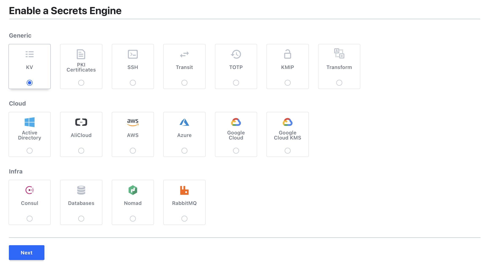
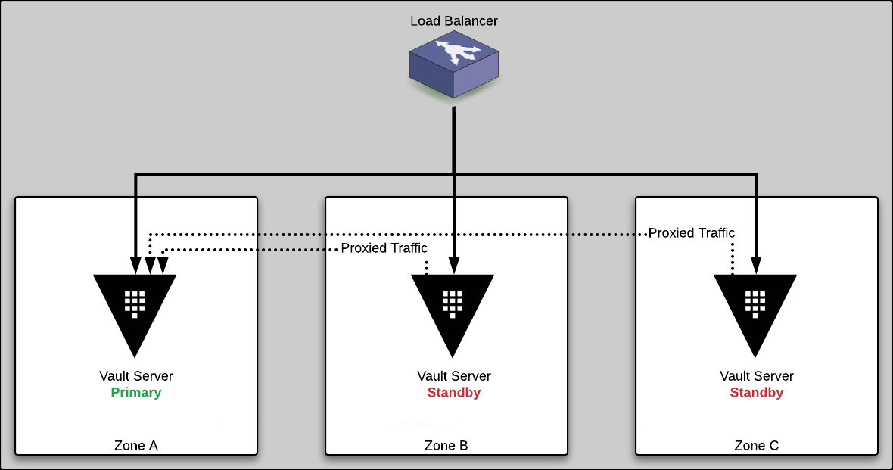

name: chapter-1
class: title, shelf, no-footer, fullbleed
background-image: url(https://hashicorp.github.io/field-workshops-assets/assets/bkgs/HashiCorp-Title-bkg.jpeg)
count: false

# Chapter 1
## HashiCorp Vault Overview

???
Chapter 1, HashiCorp Vault Overview

---
name: hashiCorp-vault-overview
# HashiCorp Vault Overview

  * HashiCorp Vault is an API-driven, cloud agnostic secrets management system.
  * It allows you to safely store and manage sensitive data in hybrid cloud environments.
  * You can also use Vault to generate dynamic short-lived credentials, or encrypt application data on the fly.

???
I like to think of Vault as an API broker. It's really an API service that works with other API addressable services to rethink how we actually access secrets, with the idea that we can build a much more secure environment by relying on identity access management, and using short-lived dynamic credentials than we can with the traditional methodologies of administrators entering static credentials and periodically rotating them.

---
name: the-old-way
layout: false
# The Traditional Security Model
.center[]
.center[Also known as the "Castle and Moat" method.]

???
You can think of the traditional security model that we've seen often in networking and infrastructure as this castle and moat approach. It's let's keep bad actors out by having a strong perimeter, but generally assume that once somebody is inside of our castle (our network) they are probably good, and therefore we can spend less time and less energy trying to validate those people internally. Unfortunately this model is flawed to begin with. There are plenty of high profile breaches that have occurred where somebody got inside of the network, into some less important system, but then once inside were able to leverage that to gain access to some more important systems they were able to compromise.

And in the cloud this really doesn't work at all. We no longer have that hard defined perimeter. Right I don't have a data center with a couple network cables crossing it where I can place firewalls. Now I have these VPCs that are running, they are all virtual constructs, all running on top of a bunch of virtual machines that I don't own, and there's other workloads right next to me that potentially could be malicious. So this really has forced us to rethink this entire model. Like I said we should have rethought it before anyways, because it really didn't work to begin with.

---
layout: true

.footer[
- Copyright © 2021 HashiCorp
- 
]

---
name: traditional-security-models
# The Traditional Security Model
* Traditional security models were built upon the idea of perimeter based security.
* There would be a firewall, and inside that firewall it was assumed one was safe.
* Resources such as databases were mostly static.  As such rules were based upon IP address, credentials were baked into source code or kept in a static file on disk.

???
Another thing about perimeter based security is it often based on IP related structures and credentials that are either baked into the code, or kept in static files. And so this is not something that goes well with our modern concept of cloud, and it also scales poorly, especially when you start adopting constructs like microservices.

---
name: problems-with-traditional-security-models
# Problems with the Traditional Security Model
* IP Address based rules
* Hardcoded credentials with problems such as:
  * Shared service accounts for apps and users
  * Difficult to rotate, decommission, and determine who has access
  * Revoking compromised credentials could break

???
* This slide describes some of the problems with the traditional security model.
---
name: the-new-way
layout: false
# Modern Secrets Management
.center[]
.center[No well defined perimeter; security enforced by identity.]

???
A modern approach is to think about security enforced by identity.

These are Mongolian Yurts or "Ger" as they are called locally. Instead of a castle with walls and a drawbridge, a fixed fortress that has an inside and an outside, these people move from place to place, bringing their houses with them.

Now I am not permitted to access all of these yurts just because I am in the same general vicinity. I have to be authenticated at each door, at the time I am trying to enter, where there is someone standing guard who can identify me, recognize me, and allow me to enter. Bringing this back to the present, you can think of each yurt as a service that someone might want to access.

And if you don't think the Nomadic way can be an effective security posture, think about this for a moment. The Mongol military tactics and organization enabled the Genghis Khan to conquer nearly all of continental Asia, the Middle East and parts of eastern Europe. Mongol warriors would typically bring three or four horses with them, so they could rotate through the horses and go farther. Mongol army units could move up to 100 miles a day, which was unheard of in the 13th century. They were faster, more adaptable, and more resilient than all their enemies.

---
name: identity-based-security-1
#Identity Based Security
.center[]
.center[[Identity Based Security and Low Trust Networks](https://www.hashicorp.com/identity-based-security-and-low-trust-networks)
]

???
Let's take a look at the high level of the Vault workflow, starting with the client. And that could be a user or an application, though we're mostly talking about applications because I think it's the harder use case to solve. But in either case, the user or the application will first authenticate with Vault and there's several ways that they can do that.

That could be they had a static secret located with them, but generally we'll try to find other methodologies. If you're talking about a human user you get relatively robust security by having a secret locked in your head and some kind of physical device with you to have two factor authentication. However that becomes a little bit more difficult when you start thinking about an application.

How do I know that this ephemeral workload is actually the workload that I want to trust or not. I mean it's only spinning up for minutes at a time. Where do I establish identity there? You're certainly not going to come in as an administrator and stick something in there on every single one of these workloads to establish that like this individual workload is authenticated. I need a dynamic way that allows me to have a strong robust construct of security for these applications, whether or not they're long lived or short lived.

Fortunately most cloud providers have some sort of construct that we can sit on top of, AWS, Azure, Google, even Kubernetes, they all some sort of endpoint, a local endpoint where these systems can query and get a bit of unique data, something that only they have access to. And they can pass that data to Vault, and Vault can reach out to those underlying systems and verify that yes, this EC2 instance for example is really part of my auto scale group, therefore I'll authenticate it.

Once we've authenticated a user or system with Vault, they then try to access a secret and that could just be a static username and password that we store inside of Vault, similar to like a 1password or lastpass. Still that's only shifting the problem one step further away -- it doesn't really solve it significantly.

So we think about the alternative and one of the key powers of vault in general is the ability to do dynamic secrets -- at the time that that application requests access to say a database, Vault can actually say Okay, I have a authenticated you, you have access to gain the secret, i'm going to generate the secret on the fly. Vault will reach out to that database and create a brand new username and credential and then hand that back to the client.

The client is then able to communicate directly with the database. vault doesn't stand in the flow of the data path. it's only in the flow of how you actually gain access to the credential. The great thing about this is hey I automated the process of getting these credentials. Now I can change the life cycle for these credentials, how long they are valid. Previously, we might have had some human come in say once a quarter, every 90 days and come actually update that secret in the database and then go update the application during a downtime window, but because I've automated this now we can do this much more frequently and I can then set policies as a security team that say not only who that authenticated has access to what but also how long, should the secrets be good for.

let's make sure this database credential is only good for an hour, or five minutes, or one minute, whatever makes sense for this particular workload. And then, at the end of that period vault is smart enough to go clean that up. Most systems that have a username password or other authentication method against them don't all have the ability to expire these credentials on a time window, and certainly not the flexibility to renew and extend them or expire them if they're not extended.

Vault brings that capability to these other systems because Vault is the one that's smart enough to clean that up.

The real advantage of this is now you've dropped that potential window of exposure, where previously it might have been months or, worse, even years, that a credential last around that if somebody had gotten a hold of they'd be able to use, to hours, or minutes.

And then, at the end of that time, we know that the credentials are no longer valid, so if somebody gets a hold of last night's backup, we already know that credential is already expired that's sitting in that system anyways. it doesn't matter, they're not gonna be able to get access to anything.

Furthermore, because Vault's constantly generating new credentials I don't have that downtime window where the credential is not the same as the secret that's been requested and the client is doing the requesting. And therefore I can actually have an overlap - I can do this live all the time, without having to wait for something to occur during the downtime window late at night or whenever it's approved.

---
layout: true

.footer[
- Copyright © 2021 HashiCorp
- 
]

---
name: identity-based-security-2
# Identity Based Security

Vault was designed to address the security needs of modern applications.  It differs from the traditional approach by using:

* Identity based rules allowing security to stretch across network perimeters
* Dynamic, short lived credentials that are rotated frequently
* Individual accounts to maintain provenance (tie action back to entity)
* Credentials and Entities that can easily be invalidated

???
So when we think about what we get out of identity based security right, we now allow the security rules to stretch across network perimeters. we create these dynamic short lived credentials that are rotated frequently and reduce our security exposure. And we can maintain provenance to tie this action back to an entity, so I know exactly who accessed the system and how they authenticated. And in the event of a compromise or breach, we can easily invalidate or revoke as few or as many of these credentials as we need to without impacting the rest of our systems.

---
name: secrets-engines
layout: false
# Vault Secrets Engines
.center[]
.center[[Vault Secrets Engines](https://www.vaultproject.io/docs/secrets/)]

???
* Vault provides many secrets engines out-of-the-box. This is a subset of what is available today.
* Others can be added as plugins. And we are continually developing and adding more capabilities.
* Today we'll go through lab exercises on three of these. Some are static, some dynamic.

---
name: vault-reference-architecture-1
# Vault Architecture Internals
.center[]
.center[[HashiCorp Vault Internals Architecture](https://www.vaultproject.io/docs/internals/architecture/)
]

???
this is an important slide as we think about the architecture of vault, this becomes important to the security model of vault in general. So starting down here at the bottom, we have the storage backend. This is an abstraction for Vault to enable the use of different underlying storage mechanisms to retain its persistent data. policies, any secrets stored in vault, configurations etc. have to be stored somewhere. today that is most commonly to disk on the Vault server node itself.

This is great because that means Vault is not dependent on having a particular cloud provider that has the support for what we need. we don't need to be in the cloud at all actually. If I'm on prem I don't need to go pay for really expensive highly available storage, I can do that in software.

How we do that in Vault is with the Raft consensus algorithm, which is a well known algorithm for distributed consensus. We've incorporated that into Vault. So it provides a highly available key value storage that's ultimately persisted to disks or volumes attached to the vault servers. and this is great because it keeps the overall architecture and configuration very simple and easy to understand. we're not dependent on having some external highly available service in order to have a redundant application -- you get that in the Vault software.

And then everything we're actually writing down to the storage backend will be encrypted via the barrier on the left there that we'll talk about shortly.

On the front end, you have the API. Every request coming into vault and all data leaving Vault goes through this API. Even if you use the command line interface for example, that just translates your CLI commands to API commands under the covers. Ideally, this API should be secured with transport layer security or TLS which is terminated on the vault servers, so I have confidence any data entering or exiting vault is secured between the client and the vault server itself.

Next it's important that we encrypt all the data inside of vault, particularly as we think about the storage backends because one of the potential points of compromise is if somebody got ahold of the storage backend or a backup of the storage backend. we don't want them to be able to use that to gain access to the secrets inside of Vault.

So Vault has a cryptographic barrier. There's an encryption key that's used to encrypt all data inside of Vault before it is written to disk. While Vault is running, that cryptographic key is stored in memory so that Vault can operate and perform all the actions it needs to perform, and then when vault is shut down or restarted we'll need to recover that key and we'll talk about the process to do that in a little bit.

Alright, what else? so we already mentioned auth methods and secrets engines, the two most common things we'll be interfacing with. there's also the system backend that's responsible for Vault configuration.

Next you'll notice path routing. Everything inside of Vault is path based. the great thing about that is it makes the policies which we're going to create very easy, but very flexible, in that we're able to say simple things like allow somebody access to this path, or deny that path. Allow them access to paths that look like this, with a star or other operators to make grouping easy. And we get some very granular very powerful access because everything is path based.

Then we have other pieces inside of here like the policy store where we can grant access. By default no access is given, Vault is deny all by default. so you have to explicitly grant access to people, and the policies are the way that we do that.

we have the expiration manager and that's what I mentioned earlier where if a credential expires, Vault is smart enough to clean it up because it has a clock ticking in the expiration manager so it knows now's the time to go clean it up.

We have the token store. we'll talk about this more when we talk about auth methods, but ultimately we reduce whatever the authentication method is to a token to ensure that we can have the ultimate flexibility where we can combine any auth method with any secrets engine. so like i can authenticate somebody using the azure managed service identity and grab them dynamic credentials to aws so they can go access an s3 bucket.

Because of the architecture of vault and how it utilizes tokens to connect all of these pieces, there's nothing wrong with that -- we can granularly swap in and out each of these components.

Finally over here on the right, we have the audit brokers and audit devices, some of the most critical components to vault really being successful. It's a construct that allows us that if an auditor was to show up, we can say with confidence, what has and has not occurred. I can actually say because everything that came in and out of Vault had to go through the HTTPS API, and everything inside of Vault is encrypted with a cryptographic barrier that I know has not been compromised, therefore, I know the audit log is complete, and so all access that occurred to some of these secrets was authenticated appropriately and all of that was logged here in the audit device.

All of this builds up the security model, so that we can say that with confidence.

---
name: vault-reference-architecture-2
# Vault Architecture - High Availability
.center[]
.center[[Vault High Availability](https://www.vaultproject.io/docs/concepts/ha/)
]

???

Here we're seeing a depiction of the Vault architecture for high availability. This diagram is for open source Vault and i'll talk a little bit about how this will differ slightly for vault enterprise.

76
00:14:06.630 --> 00:14:17.220
So we have on the back end here, the console clusters in this instance, I have five console clusters console operates, as I mentioned earlier.

77
00:14:17.850 --> 00:14:23.220
we're using something called graphs consensus protocol so they'll elect the LEADER I don't have followers.

78
00:14:24.000 --> 00:14:31.410
As long as the majority of nodes are online they'll be able to achieve consensus and then we'll be able to accept rights.

79
00:14:32.400 --> 00:14:46.500
And everything be great we lose any particular note here console still see is able to work consistently without any problems, because it's still going to have a majority, even if I lose the entire availability zone here also have three of my five minutes.

80
00:14:48.840 --> 00:14:54.600
This makes it very highly available, and if the other things we do is make it relatively performance.

81
00:14:56.130 --> 00:15:08.190
On the enterprise side we get an additional feature here, and one thing to note is if anybody licenses balta enterprise games licenses to sufficient numbers of console enterprise notes or run console.

82
00:15:08.910 --> 00:15:15.240
For vault enterprise, if they want to use and storage so console enterprise has a feature.

83
00:15:15.900 --> 00:15:32.820
called the availability zone, so we call it get with not will come non voting followers What that means is instead of having these five nodes here's split across three z's I get up six total notes, but only three of them would actually be in the cluster.

84
00:15:34.050 --> 00:15:40.500
The other three, which are the other three that are in each other one and etc that it's not voting well just the basically a hot standby.

85
00:15:40.860 --> 00:15:47.160
waiting for something to happen to the other node in that availability zone and so we'll be able to immediately promote itself to take over.

86
00:15:47.880 --> 00:15:54.420
And that way we get a similar even greater level of redundancy, particularly when combined with auto scale groups for recovery.

87
00:15:54.840 --> 00:16:05.460
Meaning that I can immediately get something to come in and saw and replace the know that failed well you know my auto scale group will hopefully eventually recognize and replace.

88
00:16:06.420 --> 00:16:17.130
And, as well as from a performance perspective there's a diminishing returns and more and more nodes that I have in a console cluster I could have 99 nodes and would still work.

89
00:16:18.330 --> 00:16:26.400
inside of the server cluster but because all of these nodes have connections to all all nodes exponentially more connections with each node we add.

90
00:16:27.300 --> 00:16:42.060
And, and ultimately causes much more traffic and a bigger gas station and performance who tends to be a sweet spot in the Open Source around five or seven where you get the two node failure redundancy and you still are decently performance.

91
00:16:43.320 --> 00:16:49.920
Beyond that usually you're paying way too much in terms of performance penalties in order to get the redundancy name.

92
00:16:50.490 --> 00:17:00.390
With enterprise like said, you can go with even smaller a three node cluster and we'll still have in really unlimited redundancy be because we have these hot standby nodes can come in.

93
00:17:02.010 --> 00:17:08.820
The vault server volt clusters work a little bit differently in this instance here, you see a three node cluster.

94
00:17:10.770 --> 00:17:18.480
This will have primaries and standbys vault Open Source it's only the primary server that actually does any work at all.

95
00:17:19.140 --> 00:17:30.030
The old standbys do is they'll proxy traffic nice thing about this is it means your load balancer doesn't necessarily have to be smart enough to know which is the vault servers the primary allison traffic there.

96
00:17:30.270 --> 00:17:34.290
They can send it to any of these notes will just seamlessly proxy it on the back end.

97
00:17:36.480 --> 00:17:49.680
We don't need to have a majority of all nodes up I could have 100 nodes of all cluster and 99 of them vote will still be up both decides who the primary is based on who has a lock on the underlying file storage.

98
00:17:50.700 --> 00:17:54.360
As long as about one note up and Scott that lock the vaults cluster will be.

99
00:17:56.490 --> 00:17:57.690
In the enterprise.

100
00:17:58.920 --> 00:18:09.780
We change this slightly to one of the issues is that well for any rights that occur obviously vaults gonna have to send them down the console console is gonna have to copy that across.

101
00:18:10.350 --> 00:18:15.330
But the vast majority of workloads that occur and vault are actually really reads.

102
00:18:16.260 --> 00:18:22.860
If I want to encrypt and decrypt data ultimately that becomes a read against the underlying system to pull up the encryption key.

103
00:18:23.670 --> 00:18:30.420
And then we become after that it's simply a cpu operation in memory.

104
00:18:30.870 --> 00:18:46.740
In memory in order to use encryption key and if I will then keep that encryption key and memory after it's loaded So if I have another request I don't even have a regenerated, which means the performance bottleneck really starts to hit this one fault server primary.

105
00:18:48.210 --> 00:18:49.590
scaling perspective.

106
00:18:50.640 --> 00:18:54.330
i've got all of these other nodes that are just sitting there waiting the takeover.

107
00:18:56.040 --> 00:19:08.670
called enterprise support, so we call read only standbys which means for the sites of traffic that can be serviced that are read based traffic which most of the time accessing a secret will be.

108
00:19:09.330 --> 00:19:23.220
Those naturally occur against any of the notes and they will service those requests if a right comes in, something that doesn't need to be to go to the primary any of these no's before justice rights over the private so that we have a consistency.

---
name: vault-reference-architecture-3
# Vault Architecture - Multi-Region
.center[]
.center[[Vault Enterprise Replication](https://www.vaultproject.io/docs/enterprise/replication/)
]

???
Vault enterprise incorporates the ability to replicate Vault secrets and configuration. There are two types of replication. the first is DR replication which is establishing a warm standby that can be activated at any time and take over the role of the active vault cluster.

We do not attempt to automatically fail over because of the inherent risk of introducing a split brain scenario. we force operators to make that determination of when it's time to flip the switch and fail over.

With DR replication in place it will copy all tokens and what we call leases so, if you have authenticated against a active Vault cluster and we fail over to the standby cluster you'll be able to continue working against that seamlessly without reauthenticating.

The other type of replication we have is called Performance replication. This type of replication is best suited for when we need to locate vault closer to the actual workload. so if i've got multiple regions around the world i'm going to want to be able to have a Vault close to that workload so i'm not sending all my traffic long distances across the network, i'm not beholden to network connectivity to allow my applications work, they can work locally.

These performance replicas will only themselves service reads, and any writes that come in will be forwarded to the primary cluster. In practice most of these interactions involve reads so that's typically not a problem. And then as you can see here the performance replicas should also have their own drs so they can fail over if necessary.

One critical difference between the Dr replication and the performance replication is that due to the unnecessary amount of traffic this would likely generate to send across the wire, Vault doesn't actually replicate those leases, the authentication tokens across to and from the the performance replicas. and therefore, if you were to jump between one performance replica and another or the primary server and a performance replica you're going to need to reauthenticate, so if we're thinking about a global load balancer architecture that becomes important.

---
layout: true

.footer[
- Copyright © 2021 HashiCorp
- 
]

---
name: chapter-1-review-question
# 📝 Chapter 1 Review

* What is HashiCorp Vault?

???
* Let's review what we learned in this chapter.
---
name: chapter-1-review-answer
# 📝 Chapter 1 Review
* What is HashiCorp Vault?
  * Vault is a Secrets Management System.
  * It is API-driven and cloud agnostic.
  * It can be used in untrusted networks.
  * It can authenticate users and applications against many systems.
  * It supports dynamic generation of short-lived secrets.
  * It runs in highly available clusters that can be replicated across regions.

???
* Here are the answers to the review questions.
